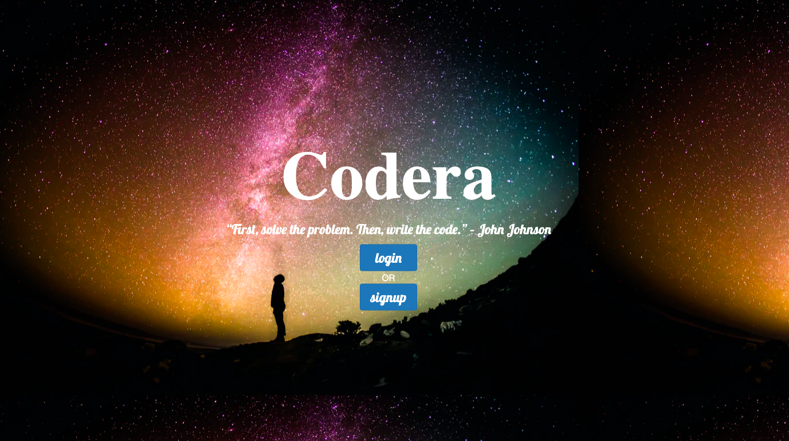
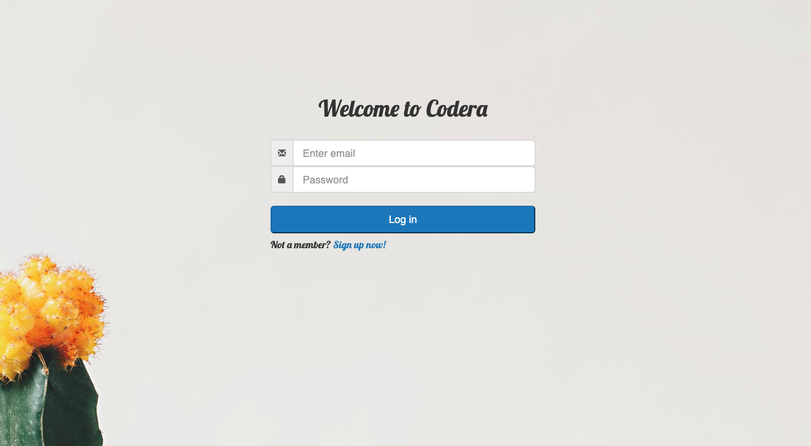
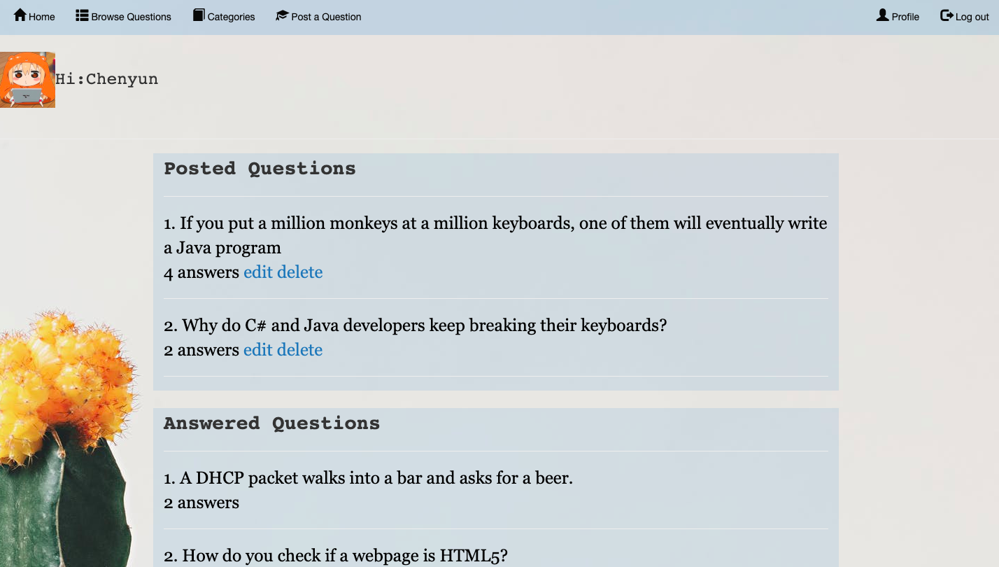
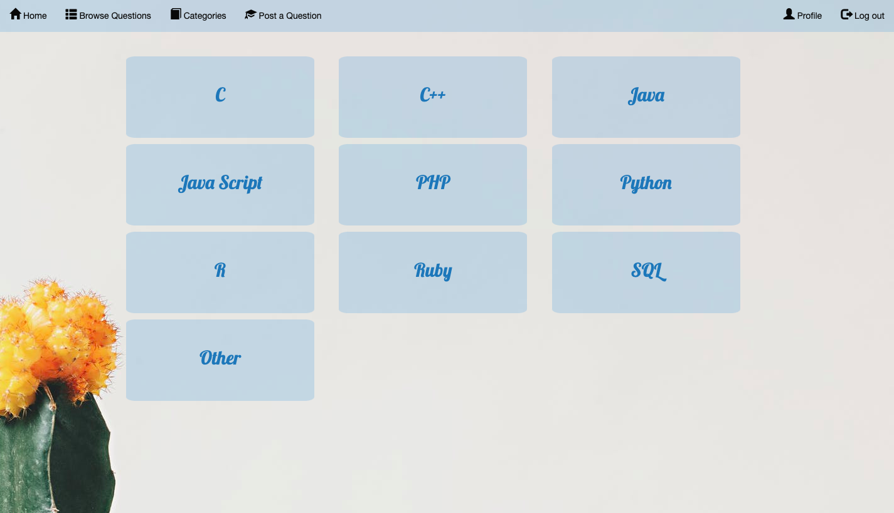
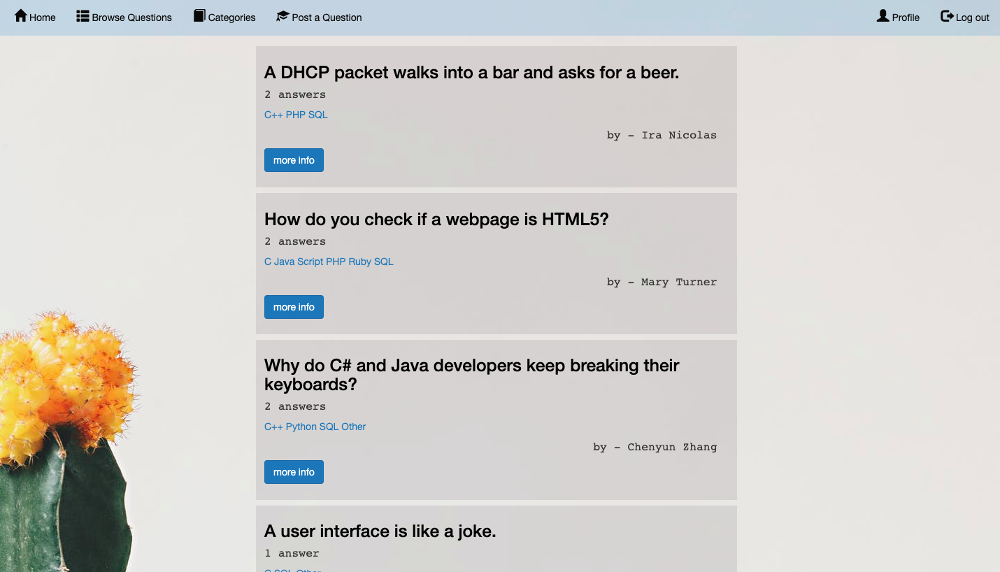
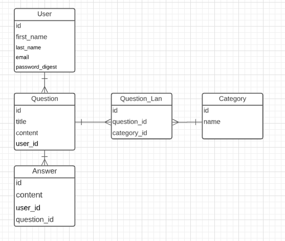

<h1>Codera</h1>

## Table of Content
<ul>
  <li><a href="#About">About</a></li>
  <li><a href="#Features">Features</a></li>
  <li><a href="https://codera-co.herokuapp.com/">Live Site</a></li>
  <li><a href="#Stacks">Stacks</a></li>
   <li><a href="#Schema">Schema</a></li>
</ul>

## About

 Codera is a full stack ruby application. It's a Q&A platform that allows users to share and grow their coding knowledges. After create an account with Codera. Users can ask or answer coding questions to their fellow developers for different programming languages or topics. Users can easily manage their answered or posted questions in their home page.

     
     
     
     
     

## Features
  <ul>
      <li>
        <ul>Password Authentication
          <li>Validate logged in users using sessions</li>
          <li>Validate email with regex</li>
        </ul>
    </li>
      <li>
        <ul>CRUD Operations
          <li>display error messages for all invalid/empty inputs</li>
          <li>Logged in user can post/edit/delete questions and answers</li>
          <li>Browser all questions, or by category</li>
        </ul>
    </li>
  </ul>
  

## Stacks
  <ul>
    <li>Ruby</li>
    <li>Ruby on Rails</li>
    <li>CSS 2D animation and Bootstrap</li>
  </ul>
  
## Schema

